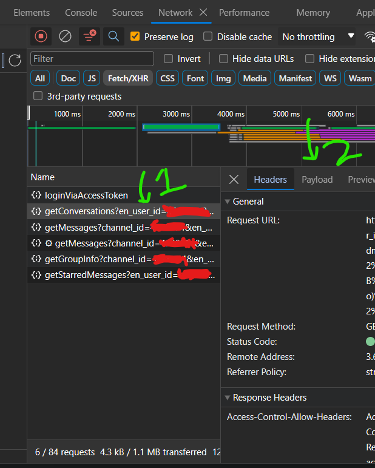

<h2 align='center'>UMS Unofficial API 🤫</h2>
<p align="center">
<a href="https://github.com/Ryuk-me"></a>
</p>

<p align="center">
<a href="https://github.com/Ryuk-me"></a>
<a href="https://github.com/Ryuk-me/UMS-Api/stargazers/"></a>
<a href="https://github.com/Ryuk-me/UMS-Api/network/members"></a>
<a href="https://github.com/Ryuk-me/UMS-Api/issues">
</a>

</p>

<p align="center">
    An Unoffical API for LPU's UMS.
</p>

> **DISCLAIMER: THIS REPO IS FOR EDUCATION PURPOSE ONLY. PLEASE DO NOT MISUSE IT.**


## Installation

```sh

# Clone the repo
$ git clone https://github.com/Ryuk-me/UMS-Api

# Go to the repository
$ cd UMS-Api

# Install virtualenv
$ pip install virtualenv

# Create Virtual Env
$ py -3 -m venv venv

# Activate Virtual Env [Windows]
$ .\venv\Scripts\activate

# Activate Virtual Env [Linux]
$ source venv/bin/activate

# Install Dependencies
$ pip install -r requirements.txt

# Setting Up ENV
> Rename .env.example to .env and fill the required details.

# Start server
$ uvicorn app.main:app --host 0.0.0.0 --port ${PORT}

# To Run Test Case
$ pytest .\tests\test.py

# Access
$ http://localhost:${PORT}/docs

# Using Docker
$ docker-compose build

# Setting Up ENV
> Rename .env.example to .env.docker and fill the required details.

# Start
$ docker-compose --env-file ./.env.docker up

# Access
$ http://localhost:${PORT}/docs

```

---

## BASIC EXAMPLES

<details open>
<summary style='font-size: 15px'><span style='font-size: 20px;font-weight:bold;'>User Login UMS</span></summary>

<br/>  

  - **Endpoint :** `/api/v1/user/login`
  - **Method :** `POST`
  - **Description :** `Returns UMS Home authenticated cookie.`


**Request Body**
```json
{
  "reg_no": "string",
  "password": "string"
}
```
**Response**
```json
{
    "cookie": "ASP.NET_SessionId=abcdeflol"
}
```
</details>

---

<details open>
<summary style='font-size: 15px'><span style='font-size: 20px;font-weight:bold;'>Placement Portal Login</span></summary>

<br/>  

  - **Endpoint :** `/api/v1/placement/login`
  - **Method :** `POST`
  - **Description :** `Returns UMS Placement Portal authenticated cookie.`


**Request Body**
```json
{
  "reg_no": "string",
  "password": "string"
}
```
**Response**
```json
{
    "cookie": "ASP.NET_SessionId=abcdeflol"
}
```
</details>

<details open>
<summary style='font-size: 15px'><span style='font-size: 20px;font-weight:bold;'>Get your details</span></summary>

<br/>  

  - **Endpoint :** `/api/v1/user/me`
  - **Method :** `POST`
  - **Description :** `Retrive current user details.`


**Request Body**
```json
{
  "reg_no": "string",
  "password": "string",
  "cookie" : "string",
}
// If cookie is not valid new cookie will be generated from the provided reg_no and password and new cookie will be sent back in response. 
```
**Response**
```json
{
    "registration_number": "122131231",
    "name": "Bhupendra Jogi",
    "program": "MCA (P164-NN1 )",
    "section": "P12614",
    "profile_image": "base64image",
    "dob": "M/DD/YYYY 12:00:00 AM",
    "cgpa": "6.9",
    "phone": "9090909090:1",
    "agg_attendance": "69",
    "roll_number": "RP12614B60",
    "cookie": "ASP.NET_SessionId=abcdeflol"
}
```
</details>

---

<details open>
<summary style='font-size: 15px'><span style='font-size: 20px;font-weight:bold;'>Search People on LPU live</span></summary>

<br/>  

  - **Endpoint :** `api/v1/misc/search_user?id=Bhupendra Jogi`
  - **Method :** `GET`
  - **Description :** `Search people on LPU live.`


**Query Params**
```json
    // Search by Name
    api/v1/misc/search_user?id=Bhupendra Jogi

    // Search by UID
    api/v1/misc/search_user?id=1231231
```
**Response**
```json

{
    "users": [
        {
            "full_name": "Bhupendra Jogi : 67152113",
            "user_id": 67152113,
            "fugu_user_id": 67152113,
            "email": "116765789897",
            "username": "116765789897",
            "department": "Computer Applications (P194-NF)",
            "user_type": 1,
            "status": "ENABLED",
            "leave_type": "",
            "phone_number": "",
            "user_thumbnail_image": "thumbnail_url",
            "user_image": "image_url"
        },
        
        .....
    ]
}
```
</details>

---

## How to get LPU LIVE TOKEN

1. `Visit lpu live website and login.`

2. `Open chrome dev tools and move to networks tab.`

3. `Apply filter FETCH/XHR.`

4. `Now refresh page.`

5. `Now click on the url where you can see en_user_id click on that link and move to payload section and copy en_user_id value and that is your LPU_LIVE_TOKEN` 



---

> **Announcement View URLS**


- https://ums.lpu.in/mobile/frmDisplayAnnouncement.aspx?aid={annoucemet_id}&tbl=Online
    
- https://ums.lpu.in/mobile/frmDisplayAnnouncement.aspx?aid={annoucemet_id}&tbl=StuGen

> Replace {annoucemet_id} with the announcement-id

Example : https://ums.lpu.in/mobile/frmDisplayAnnouncement.aspx?aid=123309&tbl=Online

---

## Author

👤 **Neeraj Kumar**

* Github: [@Ryuk-me](https://github.com/Ryuk-me)
* LinkedIN: [@Neeraj-Kumar](https://www.linkedin.com/in/neeraj-kumar-5178281b0/)

---

##### IMPORTANT NOTE
> I HAVE DEVELOPED THIS API JUST TO DISPLAY DATA. I'M NOT STEALING, STORING, SELLING  ANY KIND OF DATA. IF LPU OFFICIALS HAVE ANY KIND OF ISSUES WITH ME THEN THEY CAN MAIL ME.

### Legal
> This code is in no way affiliated with, authorized, maintained, sponsored or endorsed by LPU or any of its affiliates or subsidiaries. This is an independent and unofficial module.

## License
&copy; Neeraj Kumar | MIT